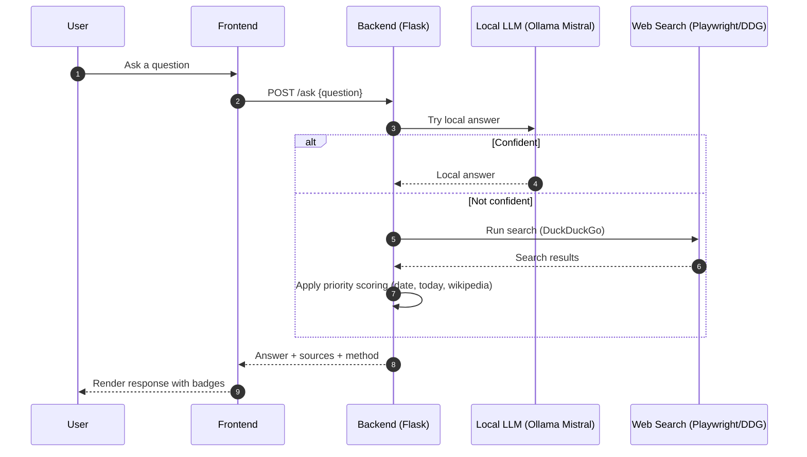

# 🌟 Nexus AI — ChatGPT‑Style Assistant + Smart Web & Product Scraper

[](#)


Nexus AI is a fast, privacy‑first AI assistant with a modern ChatGPT‑style UI that blends:
- 🧠 Local LLM (Ollama Mistral) for instant offline answers
- 🌐 CAPTCHA‑free web search via Playwright + DuckDuckGo
- 📚 Smart prioritization (today, exact dates, Wikipedia ranges)
- 🛒 Product Scraper with Table and Gallery views (images + CSV export)

This README gives you a crystal‑clear overview with diagrams, examples, and simple steps so anyone can get started quickly.

---

## 🧭 Table of Contents

- [Why Nexus AI?](#-why-nexus-ai)
- [Architecture Overview](#-architecture-overview)
- [Quick Start (One‑Click)](#-quick-start-oneclick)
- [Manual Setup](#-manual-setup)
- [How It Works (AI Answering Flow)](#-how-it-works-ai-answering-flow)
- [Product Scraper Module](#-product-scraper-module)
- [Project Structure](#-project-structure)
- [Configuration](#-configuration)
- [API Endpoints](#-api-endpoints)
- [Usage Examples](#-usage-examples)
- [Troubleshooting](#-troubleshooting)
- [Performance](#-performance)
- [Contributing, License, Support](#-contributing-license-support)

---

## 💡 Why Nexus AI?

- 🔒 Privacy first: your questions run locally whenever possible
- ⚡ Fast: local answers in seconds, web answers in 10–20s
- 🧭 Trustworthy: scoring boosts for relevant and recent info
- 🖼️ Visual scraping: real product images + data in tables
- 🖥️ Simple start: double‑click to run on Windows

Key prioritization (built‑in):
- 🗓️ Exact Date: +3000
- 📰 Today/Recent: +1000
- 📚 Wikipedia (range like “2003–2006”): +5000 (Supreme)
- 🧊 Old content penalty: −200 to −800

---

## 🏗️ Architecture Overview

```mermaid
flowchart LR
  U[User 🔵] --> F[Frontend 🖥️ (index.html)]
  F -->|POST /ask| B[Flask Backend ⚙️ (app.py)]
  B -->|Local query| L[Ollama Mistral 🧠]
  B -->|If unsure| S[Web Search 🌐 (DuckDuckGo via Playwright)]
  S --> R[Result Scorer 🧮 (priority logic)]
  L --> A[Answer Builder ✍️]
  R --> A
  A --> F
  F --> U
```

Modules:
- Frontend (HTML/CSS/JS) with a ChatGPT‑like UI
- Backend (Flask API) orchestrating responses
- Local LLM via Ollama (Mistral)
- Headless/visible Chrome via Playwright for search
- Scoring system for higher accuracy

---

## 🚀 Quick Start (One‑Click)

Windows recommended

1) Double‑click:
- START_NEXUS_AI.bat

What happens automatically:
- ✅ Checks/starts Ollama
- ✅ Starts backend (keep its window open!)
- ✅ Opens the browser UI

If you close the backend window, the UI will show a “backend not running” error. Just run START_NEXUS_AI.bat again.

---

## 🛠️ Manual Setup

First time only:
```bash
# 1) Install Ollama and pull model
# https://ollama.ai
ollama serve
ollama pull mistral

# 2) Install dependencies
pip install -r requirements.txt
# If needed:
# pip install flask flask-cors playwright requests beautifulsoup4
playwright install chrome
```

Run services:
```bash
# Terminal 1: Ollama
ollama serve

# Terminal 2: Backend
python backend/app.py

# Frontend:
# Option A: Open frontend/index.html in a browser
# Option B: Serve locally
cd frontend
python -m http.server 8000
# Visit http://localhost:8000
```

Health check:
```bash
curl http://localhost:5000/health
```

---

## 🧠 How It Works (AI Answering Flow)



Scoring tiers:
- ⭐⭐⭐⭐⭐ +5000: Wikipedia + Historical range (e.g., “2003–2006”)
- ⭐⭐⭐ +3000: Exact date match (e.g., “Oct 10, 2025”)
- ⭐⭐ +1000: Today/Recent info
- ⭐ +500: Wikipedia general
- ⚖️ 0: Standard results
- 🚫 −200 to −800: Old content penalty

---

## 🛒 Product Scraper Module

Scrape search results into structured JSON, display as Cards, Table, or Gallery with real images.

Open the views (after backend is running):
- JSON Cards: http://localhost:5000/scraper.html
- Table & Gallery: http://localhost:5000/table_view.html

Features:
- 📦 Batch processing (configurable, default 5)
- 🧹 Clean metadata extraction (title, price, specs, rating)
- 🖼️ 4–5 images per product in Gallery view
- 📤 Export CSV in Table view

High‑level flow:
```mermaid
flowchart TD
  UI[Scraper UI 🔎] -->|POST /scrape_products| API(Flask API)
  API --> SR[Search Results (DDG/Bing Fallback)]
  SR --> WB[Web Scraper (requests + BeautifulSoup)]
  WB -->|Batches| FS[(agent_state/*.json)]
  FS --> UI
  subgraph Frontend
    UI --> TableView[Table View 📊]
    UI --> GalleryView[Gallery View 🖼️]
    UI --> Cards[JSON Cards 🧾]
  end
```

Typical query:
- “top 20 laptops under 60000”
- Limit: 20, Batch size: 5 → 4 JSON batch files saved to agent_state/

---

## 📁 Project Structure

```
Nexus-App/
├─ backend/
│  ├─ app.py                # Flask API server
│  ├─ agent_step3.py        # Core agent + search/scoring logic
│  └─ agent_state/          # Saved scrape batches, state files
├─ frontend/
│  ├─ index.html            # Main chat interface
│  ├─ styles.css            # Styling
│  └─ script.js             # Frontend logic
├─ table_view.html          # Table + Gallery UI (served by backend if configured)
├─ *.bat / *.ps1            # One-click starters and helpers (Windows)
├─ requirements.txt         # Python deps
└─ README.md                # This file
```

Tip: Keep the backend window open while using the app.

---

## ⚙️ Configuration

Frontend API endpoint (in JS):
```javascript
// frontend/script.js
const API_URL = 'http://localhost:5000';
```

Ollama / Model settings (Python):
```python
# backend/agent_step3.py
OLLAMA_API = "http://127.0.0.1:11434/api/generate"
MODEL_NAME = "mistral"
channel = "chrome"  # or "msedge"
headless = false    # true = headless mode
```

Change backend port (if 5000 is busy):
```python
# backend/app.py
app.run(host="0.0.0.0", port=5001)
```
And match in frontend:
```javascript
const API_URL = 'http://localhost:5001';
```

---

## 🔌 API Endpoints

Core
- GET /health → {"status":"ok","message":"Nexus AI Backend is running"}
- POST /ask → { question: string } → { answer, method: "local"|"web", sources: [] }
- POST /shutdown → Graceful shutdown

Product Scraper
- POST /scrape_products
  - Body: { "query": "top 20 laptops under 60000", "limit": 20, "batch_size": 5 }
  - Returns: { success, total_items, total_batches, batches: [...] }
  - Saves: agent_state/scrape_batch_*.json

---

## 🧪 Usage Examples

Today’s info
```
❓ What's the weather today in Hyderabad?
✅ Boosted by +1000 (recent/today)
```

Exact date
```
❓ What's happening on October 10, 2025?
✅ +3000 exact date match 📅
```

Historical range
```
❓ What happened between 2003 and 2006?
✅ Wikipedia prioritized with +5000 🔝
```

General knowledge
```
❓ How does photosynthesis work?
🤖 Mistral answers locally (fast & private)
```

Scraper (UI)
- Open table_view.html → search “top 20 laptops under 60000” → switch Table/Gallery → Export CSV

---

## 🧩 Troubleshooting

Backend won’t start
- Check port 5000 is free
- pip install -r requirements.txt
- Start Ollama: ollama serve

Frontend can’t connect
- Verify API_URL in frontend/script.js
- Make sure backend window is open and shows “Running on http://localhost:5000”

Chrome won’t open
- playwright install chrome
- Or set channel="msedge"

CAPTCHA shows up
- Ensure DuckDuckGo is used (not Google/Bing)
- Try headless=true or private window

Port already in use
- Change Flask to 5001 (see Configuration)
- Update API_URL accordingly

System check
```bash
python test_setup.py
```

---

## 📈 Performance

- Local LLM: ~3–5s
- Web search: ~10–20s (query dependent)
- Memory (with browser): ~500MB
- Concurrent requests: supported

---

## 🤝 Contributing, License, Support

Contributing
1. Fork this repo
2. Create a feature branch
3. Make changes + add tests if applicable
4. Open a pull request

License
- MIT — free to use and modify

Support
- Open an issue if something isn’t working
- Health: http://localhost:5000/health
- Quick docs: START_HERE.md, USAGE_GUIDE.md

---

## 📷 (Optional) Screenshots & Diagrams

Place your images here and reference them in this README:
- docs/images/home.png
- docs/images/table.png
- docs/images/gallery.png

Example:
```md

```

---

Made with ❤️ for intelligent, privacy‑focused AI assistance
