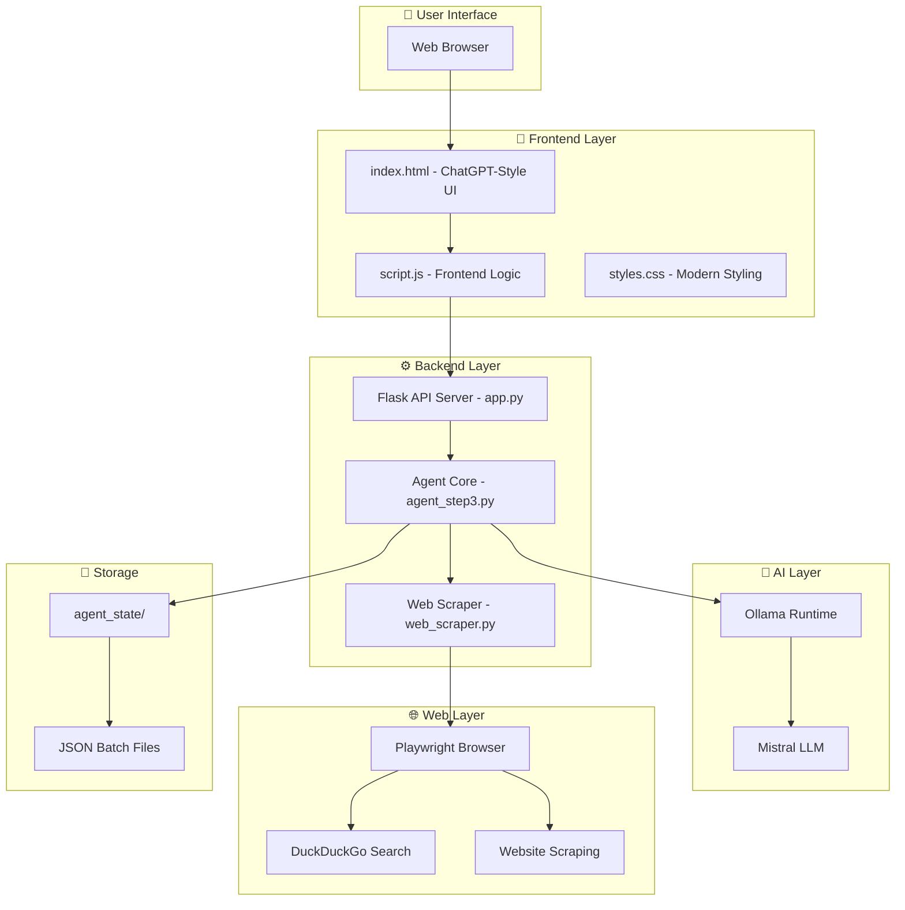
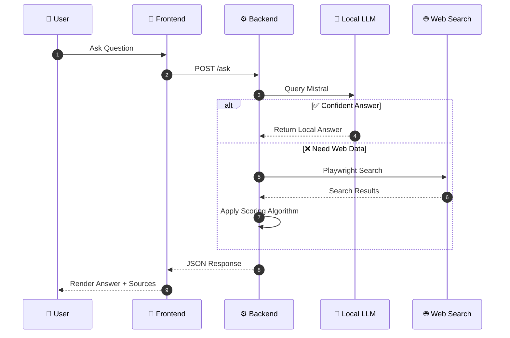
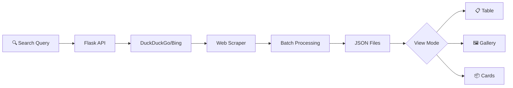
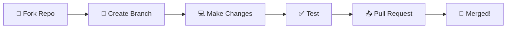

<div align="center">

# 🚀 Nexus AI — Local AI Web Navigator

### *Your Intelligent, Privacy-First AI Assistant with Smart Web Navigation*
[]
[]
[](https://opensource.org/licenses/MIT)
[](https://www.microsoft.com/windows)
[](https://github.com/AshmitThakur23)


<br>


*Harness the power of Local LLMs + Intelligent Web Scraping — All on Your Machine*

[Features](#-features) • [Quick Start](#-quick-start) • [How It Works](#-how-it-works) • [Documentation](#-documentation) 

</div>

---

[✨ Features](#-features) • [🚀 Quick Start](#-quick-start) • [🏗️ Architecture](#%EF%B8%8F-architecture) • [📖 Documentation](#-documentation) • [🛒 Product Scraper](#-product-scraper) • [📸 Screenshots](#-screenshots)

<br>

</div>

---

## 🌟 Project Overview


**Nexus AI** is a cutting-edge, privacy-first AI assistant that combines the power of **locally-hosted Large Language Models** (via Ollama) with **intelligent web navigation** using Playwright automation. 

Unlike cloud-based AI assistants, Nexus AI keeps your data on your machine while still providing real-time web intelligence when needed. 

<br>

### 🎯 Key Highlights

- 🧠 **Local AI Power** — Mistral LLM via Ollama
- 🌐 **Smart Web Search** — DuckDuckGo + Playwright
- 🛒 **Product Scraper** — Table & Gallery Views
- 🔒 **Privacy First** — 100% Local Processing
- ⚡ **Lightning Fast** — 3-5 second responses
- 🎨 **Modern UI** — ChatGPT-style interface

<br clear="both">

---

## ✨ Features

<div align="center">


</div>

<br>

<table>
<tr>
<td width="50%">

### 🧠 Local LLM Integration
```
✅ Ollama Mistral for instant offline answers
✅ 3-5 second response times
✅ Zero data leaves your machine
✅ Full conversation context support
```

</td>
<td width="50%">

### 🌐 Intelligent Web Search
```
✅ CAPTCHA-free DuckDuckGo integration
✅ Playwright-powered browser automation
✅ Smart result prioritization & scoring
✅ Real-time web data aggregation
```

</td>
</tr>
<tr>
<td width="50%">

### 🛒 Product Scraper Module
```
✅ Table View with sortable columns
✅ Gallery View with product images
✅ CSV export functionality
✅ Batch processing (configurable)
```

</td>
<td width="50%">

### 💡 Smart Prioritization Engine
```
📅 Exact Date: +3000 score boost
📰 Today/Recent: +1000 score boost
📚 Wikipedia Range: +5000 supreme priority
🧊 Old Content: Penalty system
```

</td>
</tr>
</table>

---

## 🎨 Tech Stack

<div align="center">

<br>


<br><br>

| Technology | Purpose | Version |
|:---:|:---:|:---:|
|  | Backend & AI Logic | 3.10+ |
|  | REST API Server | 3.x |
|  | Browser Automation | 1.48 |
|  | HTML Parsing | 4. 12 |
|  | Local LLM Runtime | Latest |
|  | Frontend UI | 5 |
|  | Styling | 3 |
|  | Frontend Logic | ES6+ |

</div>

---

## 🏗️ Architecture

<div align="center">


</div>



<br>

### 🔄 Request Flow



---

## 🚀 Quick Start

<div align="center">


</div>

<br>

### ⚡ One-Click Start (Windows)

<div align="center">

| Script | Description |
|:---:|:---|
| 🟢 **START_NEXUS_FIXED.bat** | Full Setup - Starts Ollama + Backend + Opens Browser |
| 🔵 **START_BACKEND_FIXED.bat** | Backend Only - Manual frontend opening |
| 🟣 **START_NEXUS_AI.ps1** | PowerShell - Alternative starter |

</div>

```bash
# Simply double-click any . bat file to start! 
```

<br>

### 🛠️ Manual Installation

<details>
<summary><b>📋 Click to expand Step-by-Step Setup Guide</b></summary>

<br>

#### Prerequisites

```bash
# 1️⃣ Install Ollama (https://ollama.ai)

# 2️⃣ Pull the Mistral model
ollama pull mistral

# 3️⃣ Clone the repository
git clone https://github.com/AshmitThakur23/Local-AI-Web-Navigator.git
cd Local-AI-Web-Navigator

# 4️⃣ Install Python dependencies
pip install -r requirements.txt

# 5️⃣ Install Playwright browsers
playwright install chrome
```

#### Running the Application

```bash
# Terminal 1: Start Ollama
ollama serve

# Terminal 2: Start Backend
python backend/app.py

# Terminal 3: Serve Frontend (Optional)
cd frontend
python -m http.server 8000
# Visit: http://localhost:8000
```

#### Health Check

```bash
curl http://localhost:5000/health
# Response: {"status":"ok","message":"Nexus AI Backend is running"}
```

</details>

---

## 📁 Project Structure

```
📦 Local-AI-Web-Navigator/
│
├── 🎨 frontend/
│   ├── index.html              # Main ChatGPT-style interface
│   ├── script.js               # Frontend logic & API calls
│   ├── styles.css              # Modern dark theme styling
│   ├── setup.html              # Setup wizard page
│   └── _redirects              # Netlify routing config
│
├── ⚙️ backend/
│   ├── app. py                  # Flask REST API server
│   ├── agent_step3.py          # Core AI agent & scoring logic
│   ├── web_scraper.py          # BeautifulSoup web scraper
│   ├── test_mistral_speed.py   # Performance testing
│   └── agent_state/            # Saved scrape batches
│
├── 🚀 Starters/
│   ├── START_NEXUS_FIXED.bat       # One-click full start
│   ├── START_BACKEND_FIXED.bat     # Backend only
│   ├── START_NEXUS_AI. ps1          # PowerShell starter
│   └── start_all_services.py       # Python launcher
│
├── 📖 Documentation/
│   ├── DEPLOYMENT_GUIDE.md
│   ├── USAGE_GUIDE.md
│   ├── PRODUCT_SCRAPER_GUIDE.md
│   ├── NVIDIA_GPU_CONFIG.md
│   └── ...  (more guides)
│
├── requirements.txt            # Python dependencies
├── netlify.toml                # Deployment config
└── README.md                   # You are here!  📍
```

---

## 🛒 Product Scraper

<div align="center">


<br><br>

### 🎯 Scrape Products Like a Pro! 

</div>

<br>

The Product Scraper module allows you to extract structured product data from the web with support for multiple view modes. 

<br>

### 📊 View Modes

<table>
<tr>
<td align="center" width="33%">

#### 📋 Table View
```
http://localhost:5000/table_view. html
```
✅ Sortable columns<br>
✅ CSV export<br>
✅ Clean data layout

</td>
<td align="center" width="33%">

#### 🖼️ Gallery View
```
http://localhost:5000/table_view.html
```
✅ 4-5 images per product<br>
✅ Visual browsing<br>
✅ Quick overview

</td>
<td align="center" width="33%">

#### 📦 JSON Cards
```
http://localhost:5000/scraper. html
```
✅ Raw JSON data<br>
✅ Developer friendly<br>
✅ API integration

</td>
</tr>
</table>

<br>

### 🔄 Scraper Flow



<br>

### 💡 Example Usage

```javascript
// API Call
POST /scrape_products
{
    "query": "top 20 laptops under 60000",
    "limit": 20,
    "batch_size": 5
}

// Response
{
    "success": true,
    "total_items": 20,
    "total_batches": 4,
    "batches": [...]
}
```

---

## 🔌 API Reference

<div align="center">


<br><br>

### 📡 Available Endpoints

</div>

<br>

| Method | Endpoint | Description | Request Body |
|:---:|:---|:---|:---|
| `GET` | `/health` | Health check | - |
| `POST` | `/ask` | Ask AI question | `{ "question": "..." }` |
| `POST` | `/scrape_products` | Scrape products | `{ "query": ".. .", "limit": 20 }` |
| `POST` | `/shutdown` | Graceful shutdown | - |

<br>

### 📝 Response Format

```json
{
    "answer": "Your detailed answer here.. .",
    "method": "local | web",
    "sources": [
        {
            "title": "Source Title",
            "url": "https://.. .",
            "score": 5000
        }
    ]
}
```

---

## ⚙️ Configuration

<details>
<summary><b>🔧 Click to expand Customization Options</b></summary>

<br>

### Frontend Configuration

```javascript
// frontend/script.js
const API_URL = 'http://localhost:5000';  // Change if using different port
```

### Backend Configuration

```python
# backend/agent_step3.py
OLLAMA_API = "http://127.0.0. 1:11434/api/generate"
MODEL_NAME = "mistral"
channel = "chrome"      # or "msedge"
headless = False        # True for headless mode
```

### Port Configuration

```python
# backend/app. py
app.run(host="0.0.0.0", port=5001)  # Change port here
```

</details>

---

## 📈 Performance

<div align="center">

| Metric | Value |
|:---:|:---:|
| ⚡ Local LLM Response | **3-5 seconds** |
| 🌐 Web Search Response | **10-20 seconds** |
| 💾 Memory Usage | **~500MB** (with browser) |
| 🔄 Concurrent Requests | **Supported** |
| 🖥️ GPU Acceleration | **NVIDIA CUDA** (optional) |

</div>

---

## 🧠 Scoring Algorithm

<div align="center">

The intelligent scoring system prioritizes relevant and recent information:

</div>

<br>

| Priority Level | Score Boost | Trigger |
|:---:|:---:|:---|
| ⭐⭐⭐⭐⭐ | **+5000** | Wikipedia + Historical range (e.g., "2003–2006") |
| ⭐⭐⭐⭐ | **+3000** | Exact date match (e.g., "Oct 10, 2025") |
| ⭐⭐⭐ | **+1000** | Today/Recent information |
| ⭐⭐ | **+500** | Wikipedia general articles |
| ⭐ | **0** | Standard results |
| 🚫 | **-200 to -800** | Old/outdated content penalty |

---

## 🧪 Usage Examples

<div align="center">


<br><br>

### 💬 Chat Examples

</div>

<br>

```
┌─────────────────────────────────────────────────────────────────┐
│  🌤️ Today's Information                                         │
│  ❓ "What's the weather today in Hyderabad?"                    │
│  ✅ Boosted by +1000 (recent/today priority)                    │
└─────────────────────────────────────────────────────────────────┘

┌─────────────────────────────────────────────────────────────────┐
│  📅 Exact Date Query                                            │
│  ❓ "What's happening on October 10, 2025?"                     │
│  ✅ +3000 exact date match priority 📅                          │
└─────────────────────────────────────────────────────────────────┘

┌─────────────────────────────────────────────────────────────────┐
│  📚 Historical Range                                            │
│  ❓ "What happened between 2003 and 2006?"                      │
│  ✅ Wikipedia prioritized with +5000 🔝                         │
└─────────────────────────────────────────────────────────────────┘

┌─────────────────────────────────────────────────────────────────┐
│  🧠 General Knowledge                                           │
│  ❓ "How does photosynthesis work?"                             │
│  ✅ Mistral answers locally (fast & private) 🔒                 │
└─────────────────────────────────────────────────────────────────┘
```

---

## 🔧 Troubleshooting

<details>
<summary><b>🐛 Click to expand Common Issues & Solutions</b></summary>

<br>

### ❌ Backend Won't Start

```bash
# Check if port 5000 is free
netstat -ano | findstr :5000

# Reinstall dependencies
pip install -r requirements.txt

# Start Ollama first
ollama serve
```

### ❌ Frontend Can't Connect

```javascript
// Verify API_URL in frontend/script.js
const API_URL = 'http://localhost:5000';

// Make sure backend window shows:
// "Running on http://localhost:5000"
```

### ❌ Chrome Won't Open

```bash
# Install Playwright browsers
playwright install chrome

# Or use Edge instead
# Set channel="msedge" in agent_step3.py
```

### ❌ CAPTCHA Issues

```python
# Ensure DuckDuckGo is used (not Google/Bing for main search)
# Try headless mode: headless = True
```

### 🔍 System Check

```bash
python test_setup.py
```

</details>

---

## 🤝 Contributing

<div align="center">

We welcome contributions! Here's how you can help:

</div>

<br>



<br>

1. **Fork** the repository
2.  **Create** a feature branch (`git checkout -b feature/amazing-feature`)
3.  **Commit** your changes (`git commit -m 'Add amazing feature'`)
4. **Push** to the branch (`git push origin feature/amazing-feature`)
5.  **Open** a Pull Request

---

## 📜 License

<div align="center">

This project is licensed under the **MIT License** - see the [LICENSE](LICENSE) file for details. 
# NOTICE

This project, Nexus AI - Local AI Web Navigator, was created by:

**Ashmit Thakur**
- GitHub: https://github.com/AshmitThakur23
- Repository: https://github. com/AshmitThakur23/Local-AI-Web-Navigator

## Original Creation Date
October 2024

## Copyright
© 2024 Ashmit Thakur. All rights reserved. 

If you fork, clone, or use any part of this code, you MUST:
1. Give credit to the original author
2.  Include this NOTICE file
3.  Include the LICENSE file
4. Not claim this as your own original work

Violation of these terms may result in DMCA takedown requests.

<br>

</div>

---

## 👨‍💻 Author

<div align="center">


<br><br>

### **Ashmit Thakur**

<br>

</div>

---

## ⭐ Show Your Support

<div align="center">

If you found this project helpful, please consider giving it a ⭐! 

<br>

[](https://github.com/AshmitThakur23/Local-AI-Web-Navigator/stargazers)
[]
[]

</div>

---

<div align="center">


<br>

### 🚀 Built with ❤️ for Intelligent, Privacy-Focused AI Assistance

<br>


</div>
