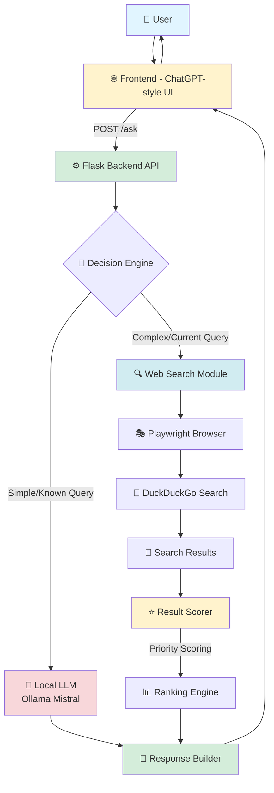
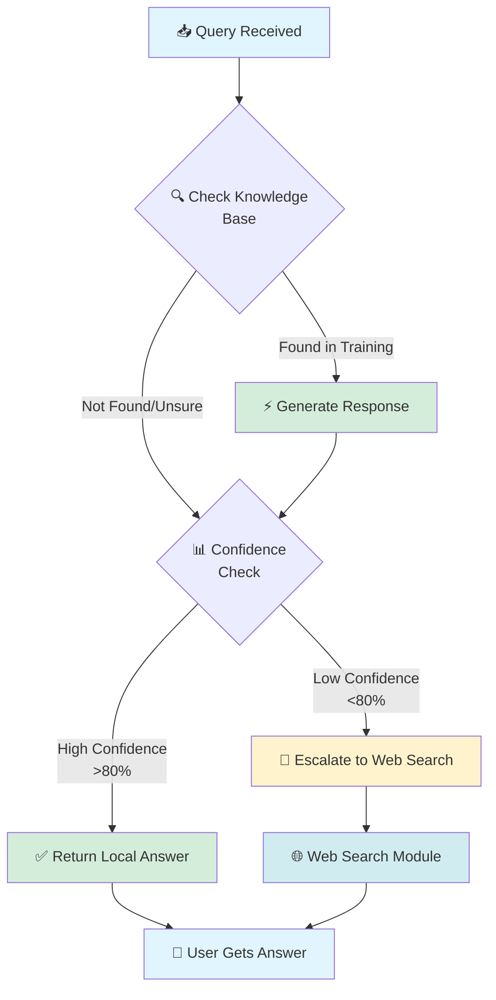
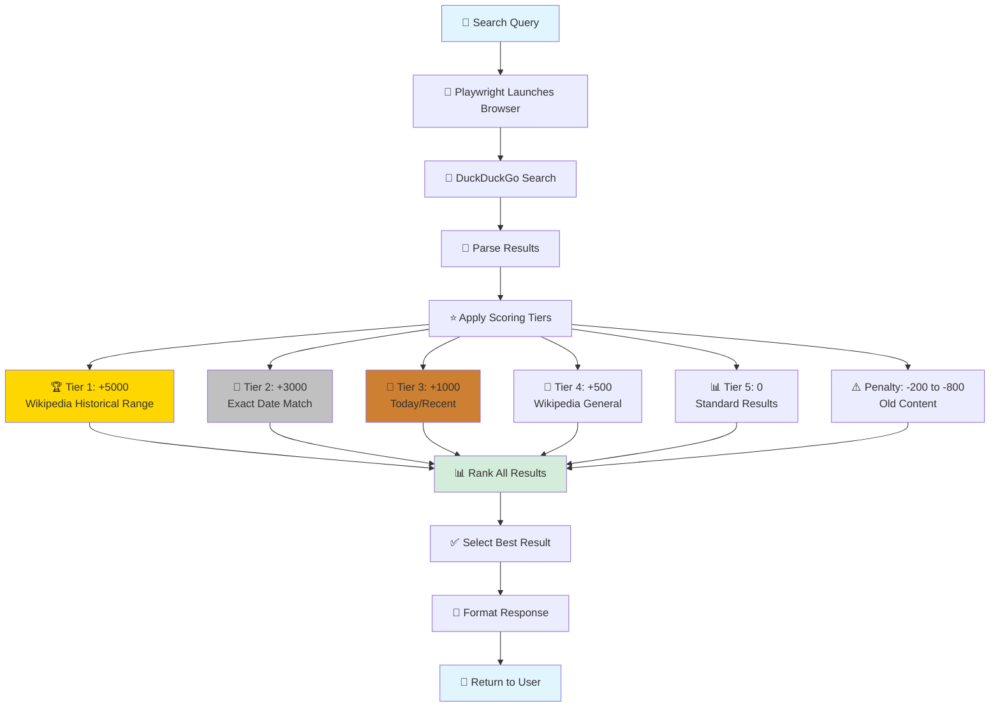
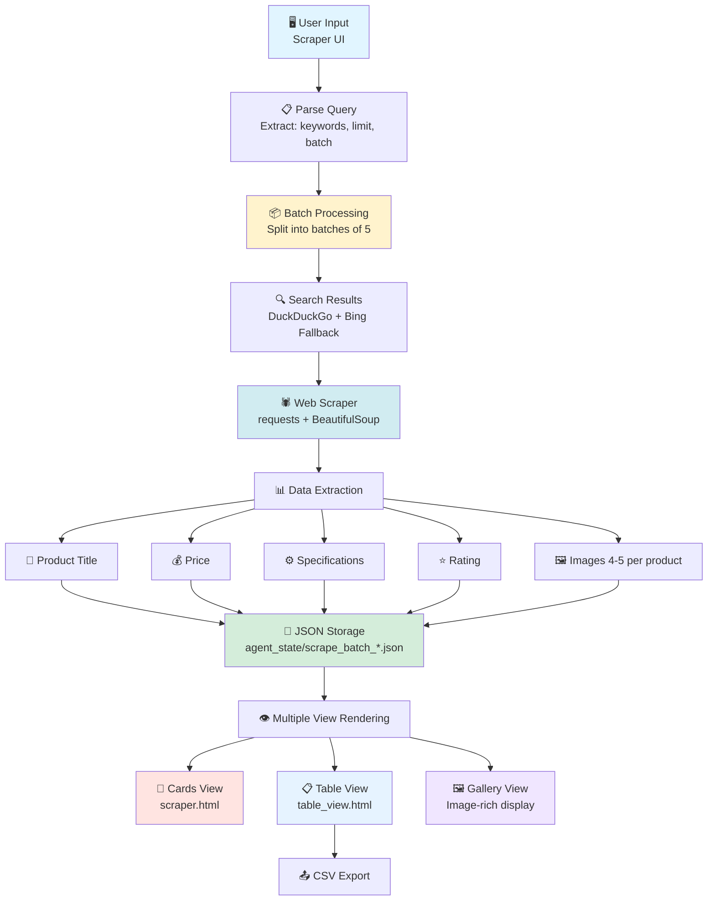

<div align="center">


<h3>🚀 Your Intelligent Local AI Assistant with Smart Web Search 🚀</h3>

<p align="center">
  <a href="#"></a>
  <a href="#"></a>
  <a href="#"></a>
  <a href="#"></a>
  <a href="#"></a>
  <a href="#"></a>
</p>

<p align="center">
  <a href="#"></a>
  <a href="#"></a>
  <a href="#"></a>
</p>

<p align="center">
  <strong>
    <a href="#-features">Features</a> •
    <a href="#-quick-start-one-click">Quick Start</a> •
    <a href="#-how-it-works-step-by-step">How It Works</a> •
    <a href="#-api-endpoints">Documentation</a>
  </strong>
</p>

</div>

---

Nexus AI is a fast, privacy-first AI assistant with a modern ChatGPT-style UI that seamlessly blends local intelligence with smart web search capabilities:
- 🧠 **Local LLM** (Ollama Mistral) for instant offline answers
- 🌐 **CAPTCHA-free web search** via Playwright + DuckDuckGo
- 📚 **Smart prioritization** (today, exact dates, Wikipedia ranges)
- 🛒 **Product Scraper** with Table and Gallery views (images + CSV export)

This README gives you a crystal-clear overview with diagrams, examples, and simple steps so anyone can get started quickly.

---

## 🧭 Table of Contents

- [Features](#-features)
- [Complete System Architecture](#-complete-system-architecture)
- [Quick Start (One-Click)](#-quick-start-oneclick)
- [Manual Setup](#-manual-setup)
- [How It Works (Step by Step)](#-how-it-works-step-by-step)
- [Technology Stack](#-technology-stack)
- [Local LLM Processing](#-local-llm-processing-flow)
- [Web Search with Scoring](#-web-search-flow-with-scoring)
- [Product Scraper Pipeline](#-product-scraper-pipeline)
- [Demo Examples](#-demo-examples)
- [Project Structure](#-project-structure)
- [Configuration](#-configuration)
- [API Endpoints](#-api-endpoints)
- [Troubleshooting](#-troubleshooting)
- [Performance](#-performance)
- [Contributing, License, Support](#-contributing-license-support)

---

## ✨ Features

<div align="center">

| Feature | Description |
|---------|-------------|
| 🧠 **Local AI Processing** | Run AI models locally with Ollama Mistral for instant, private responses |
| 🌐 **Smart Web Search** | CAPTCHA-free web search powered by Playwright and DuckDuckGo |
| 🛒 **Product Scraper** | Advanced web scraping for product data with batch processing |
| 📊 **Multiple View Modes** | Display results in Cards, Table, or Gallery formats |
| 🔒 **Privacy First** | Your questions run locally whenever possible - no data sent to third parties |
| ⚡ **Fast Response Times** | Local answers in 3-5s, web searches in 10-20s |
| 📈 **Intelligent Scoring** | Priority scoring system for most relevant and recent information |
| 🖼️ **Image Support** | Gallery view with 4-5 images per product |
| 📤 **Data Export** | Export scraped data as CSV for further analysis |
| 🎯 **Accurate Results** | Advanced scoring with date awareness and source prioritization |

</div>

### Key Prioritization Built-in:
- 🗓️ **Exact Date**: +3000 points for precise date matches
- 📰 **Today/Recent**: +1000 points for current information  
- 📚 **Wikipedia Range**: +5000 points (Supreme) for historical ranges like "2003–2006"
- 🧊 **Old Content Penalty**: −200 to −800 points for outdated information

---

## 🏗️ Complete System Architecture



**System Components:**
- **Frontend**: Modern ChatGPT-like interface (HTML/CSS/JS)
- **Flask Backend**: Orchestrates all operations and API endpoints
- **Decision Engine**: Routes queries to local LLM or web search
- **Local LLM**: Ollama Mistral for fast, private responses
- **Web Search**: Playwright-powered headless/visible Chrome for DuckDuckGo
- **Scoring System**: Priority-based ranking for accuracy and relevance
- **Response Builder**: Formats and delivers final answers with source attribution

---

## 🚀 Quick Start (One-Click)

**Windows recommended**

1) Double-click one of these:
   - **START_NEXUS_FIXED.bat** — Full setup (starts Ollama + backend + opens browser)
   - **START_BACKEND_FIXED.bat** — Backend only (if you want to open frontend manually)

What happens automatically:
- ✅ Checks/starts Ollama
- ✅ Starts backend (keep its window open!)
- ✅ Opens the browser UI (with START_NEXUS_FIXED.bat)

> **Note:** If you close the backend window, the UI will show a "backend not running" error. Just run START_NEXUS_FIXED.bat again.

---

## 🛠️ Manual Setup

### First time only:

```bash
# 1) Install Ollama and pull model
# https://ollama.ai
ollama serve
ollama pull mistral

# 2) Install dependencies
pip install -r requirements.txt
# If needed:
# pip install flask flask-cors playwright requests beautifulsoup4
playwright install chrome
```

### Run services:

```bash
# Terminal 1: Ollama
ollama serve

# Terminal 2: Backend
python backend/app.py

# Frontend:
# Option A: Open frontend/index.html in a browser
# Option B: Serve locally
cd frontend
python -m http.server 8000
# Visit http://localhost:8000
```

### Health check:

```bash
curl http://localhost:5000/health
```

---

## 🎯 How It Works (Step by Step)

**Complete flow from question to answer:**

1. **👤 User Asks a Question**  
   User types a query in the ChatGPT-style interface

2. **📨 Frontend Sends Request**  
   POST request to `/ask` endpoint with the question

3. **🤔 Decision Engine Evaluates**  
   Backend analyzes query complexity and nature

4. **🔀 Route Selection**  
   - **Simple/General Knowledge** → Local LLM (fast & private)
   - **Current/Specific Info** → Web Search (accurate & fresh)

5. **🧠 Local LLM Path** (if chosen)  
   - Ollama Mistral processes query locally
   - Generates answer from training data
   - Returns response in 3-5 seconds

6. **🌐 Web Search Path** (if chosen)  
   - Playwright launches headless Chrome
   - Searches DuckDuckGo for results
   - Parses and extracts information

7. **⭐ Priority Scoring Applied**  
   - Date matching: +3000 for exact dates
   - Recency: +1000 for today/recent
   - Authority: +5000 for Wikipedia historical ranges
   - Penalty: -200 to -800 for old content

8. **📊 Results Ranked**  
   Best results selected based on score

9. **📝 Response Built**  
   Formatted answer with sources and method badges

10. **✅ User Receives Answer**  
    Displayed with visual indicators for local/web method

---

## 💻 Technology Stack

<div align="center">

### Backend Technologies


### AI & Search


### Frontend Technologies


</div>

---

## 🧠 Local LLM Processing Flow



**Process Details:**
1. **Query Analysis**: Parse and understand user intent
2. **Knowledge Check**: Search through local model's training data
3. **Confidence Evaluation**: Assess answer quality and certainty
4. **Decision Point**: Return if confident, escalate if uncertain
5. **Response Delivery**: Fast local answer (3-5 seconds) or handoff to web search

---

## 🔍 Web Search Flow with Scoring



**Scoring System Breakdown:**

| Priority Tier | Score | Criteria | Example |
|---------------|-------|----------|---------|
| 🏆 Supreme | +5000 | Wikipedia + Historical Range | "2003–2006", "1990-1995" |
| 🥇 Very High | +3000 | Exact Date Match | "October 10, 2025" |
| 🥈 High | +1000 | Today/Recent Keywords | "today", "latest", "current" |
| 🥉 Medium | +500 | Wikipedia General | Any Wikipedia article |
| 📊 Standard | 0 | Regular Results | Standard web pages |
| ⚠️ Penalty | -200 to -800 | Old Content | Based on age |

---

## 🛒 Product Scraper Pipeline



**Pipeline Features:**
- **Batch Processing**: Configurable batch size (default: 5 products per batch)
- **Clean Metadata**: Extracts title, price, specifications, ratings
- **Image Handling**: 4-5 high-quality images per product in Gallery view
- **Flexible Output**: Cards for quick view, Table for comparison, Gallery for visual browsing
- **Data Export**: Export table data as CSV for external analysis

**Typical Usage:**
```
Query: "top 20 laptops under 60000"
Limit: 20 products
Batch size: 5
Result: 4 JSON batch files saved to agent_state/
```

---

## 💬 Demo Examples

<div align="center">

### Example Interactions

</div>

**📰 Current Information Query:**
```
💬 User: "What's the weather in New York today?"

🤖 Nexus AI:
   Method: 🌐 Web Search
   Boost: +1000 (today keyword)
   Answer: Current weather in New York is 72°F, partly cloudy...
   Sources: [weather.com, accuweather.com]
```

**🧠 General Knowledge Query:**
```
💬 User: "Explain quantum computing"

🤖 Nexus AI:
   Method: 🧠 Local LLM
   Speed: ⚡ 3.2 seconds
   Answer: Quantum computing is a type of computation that harnesses...
   Note: Private, offline answer
```

**📅 Date-Specific Query:**
```
💬 User: "What happened on December 7, 2023?"

🤖 Nexus AI:
   Method: 🌐 Web Search
   Boost: +3000 (exact date)
   Answer: Events that occurred on December 7, 2023...
   Sources: [wikipedia.org, news.com]
```

**📚 Historical Query:**
```
💬 User: "What happened between 2003 and 2006?"

🤖 Nexus AI:
   Method: 🌐 Web Search
   Boost: +5000 (Wikipedia historical range - SUPREME)
   Answer: Major events from 2003-2006 include...
   Sources: [wikipedia.org - historical articles]
```

**🛒 Product Search:**
```
💬 User: Opens table_view.html → searches "top 20 laptops under 60000"

🤖 Nexus AI:
   ✅ Scraped 20 products
   ✅ Saved to 4 batch files
   📊 View Options: Table | Gallery
   📤 Export: CSV available
```

---

## 📁 Project Structure

```
Nexus-App/
├─ backend/
│  ├─ app.py                # Flask API server
│  ├─ agent_step3.py        # Core agent + search/scoring logic
│  ├─ web_scraper.py        # Product scraper module
│  └─ agent_state/          # Saved scrape batches, state files
├─ frontend/
│  ├─ index.html            # Main chat interface
│  ├─ styles.css            # Styling
│  ├─ script.js             # Frontend logic
│  ├─ scraper.html          # Product scraper cards view
│  └─ table_view.html       # Table & gallery views
├─ *.bat / *.ps1            # One-click starters and helpers (Windows)
├─ requirements.txt         # Python deps
└─ README.md                # This file
```

**Tip:** Keep the backend window open while using the app.

---

## ⚙️ Configuration

### Frontend API endpoint (in JS):

```javascript
// frontend/script.js
const API_URL = 'http://localhost:5000';
```

### Ollama / Model settings (Python):

```python
# backend/agent_step3.py
OLLAMA_API = "http://127.0.0.1:11434/api/generate"
MODEL_NAME = "mistral"
channel = "chrome"  # or "msedge"
headless = false    # true = headless mode
```

### Change backend port (if 5000 is busy):

```python
# backend/app.py
app.run(host="0.0.0.0", port=5001)
```

And match in frontend:

```javascript
const API_URL = 'http://localhost:5001';
```

---

## 🔌 API Endpoints

### Core Endpoints

| Endpoint | Method | Description | Request Body | Response |
|----------|--------|-------------|--------------|----------|
| `/health` | GET | Health check | - | `{"status":"ok","message":"..."}` |
| `/ask` | POST | Ask a question | `{"question": "..."}` | `{"answer": "...", "method": "local/web", "sources": [...]}` |
| `/shutdown` | POST | Graceful shutdown | - | `{"message": "..."}` |

### Product Scraper Endpoints

| Endpoint | Method | Description | Request Body | Response |
|----------|--------|-------------|--------------|----------|
| `/scrape_products` | POST | Scrape products | `{"query": "...", "limit": 20, "batch_size": 5}` | `{"success": true, "total_items": 20, "batches": [...]}` |

**Example Request:**

```bash
curl -X POST http://localhost:5000/ask \
  -H "Content-Type: application/json" \
  -d '{"question": "What is the capital of France?"}'
```

**Example Response:**

```json
{
  "answer": "Paris is the capital of France.",
  "method": "local",
  "sources": [],
  "confidence": "high"
}
```

---

## 🧩 Troubleshooting

### Backend won't start
- ✅ Check port 5000 is free: `netstat -ano | findstr :5000`
- ✅ Install dependencies: `pip install -r requirements.txt`
- ✅ Start Ollama: `ollama serve`

### Frontend can't connect
- ✅ Verify API_URL in `frontend/script.js`
- ✅ Make sure backend window is open and shows "Running on http://localhost:5000"
- ✅ Check browser console for errors (F12)

### Chrome won't open
- ✅ Install Playwright browsers: `playwright install chrome`
- ✅ Or set `channel="msedge"` in backend config

### CAPTCHA shows up
- ✅ Ensure DuckDuckGo is used (not Google/Bing)
- ✅ Try `headless=true` or private window mode
- ✅ Clear browser cookies/cache

### Port already in use
- ✅ Change Flask to port 5001 (see Configuration)
- ✅ Update `API_URL` in frontend accordingly
- ✅ Kill process using port: `taskkill /F /PID <pid>`

### System check

```bash
python test_setup.py
```

---

## 📈 Performance

| Metric | Performance |
|--------|-------------|
| **Local LLM Response** | ~3–5 seconds |
| **Web Search Response** | ~10–20 seconds (query dependent) |
| **Memory Usage** | ~500MB (with browser) |
| **Concurrent Requests** | Supported (Flask threading) |
| **Scraper Batch Processing** | ~2-3 seconds per batch of 5 products |
| **Startup Time** | ~5-10 seconds (with one-click launcher) |

**Optimization Tips:**
- Use local LLM for general knowledge (faster)
- Enable headless mode for web search (lower memory)
- Adjust batch size for scraper based on system resources
- Close unnecessary browser tabs to free memory

---

## 🤝 Contributing, License, Support

### Contributing

We welcome contributions! Here's how you can help:

1. **Fork this repository**
2. **Create a feature branch** (`git checkout -b feature/AmazingFeature`)
3. **Make your changes** and add tests if applicable
4. **Commit your changes** (`git commit -m 'Add some AmazingFeature'`)
5. **Push to the branch** (`git push origin feature/AmazingFeature`)
6. **Open a Pull Request**

### License

This project is licensed under the **MIT License** - see the LICENSE file for details.

**TL;DR:** Free to use, modify, and distribute. No warranties provided.

### Support

Need help? We've got you covered:

- 📖 **Documentation**: Check START_HERE.md and USAGE_GUIDE.md
- 🐛 **Bug Reports**: Open an issue on GitHub
- 💡 **Feature Requests**: Open an issue on GitHub
- 🏥 **Health Check**: http://localhost:5000/health
- 💬 **Questions**: Start a discussion in the repository

---

<div align="center">


**Made with ❤️ for intelligent, privacy-focused AI assistance**

<p>
  <strong>⭐ Star this repo if you find it helpful!</strong><br>
  <strong>🔀 Fork it to make it your own!</strong><br>
  <strong>🤝 Contribute to make it better!</strong>
</p>

<sub>Nexus AI - Bridging Local Intelligence with Global Knowledge</sub>

</div>
